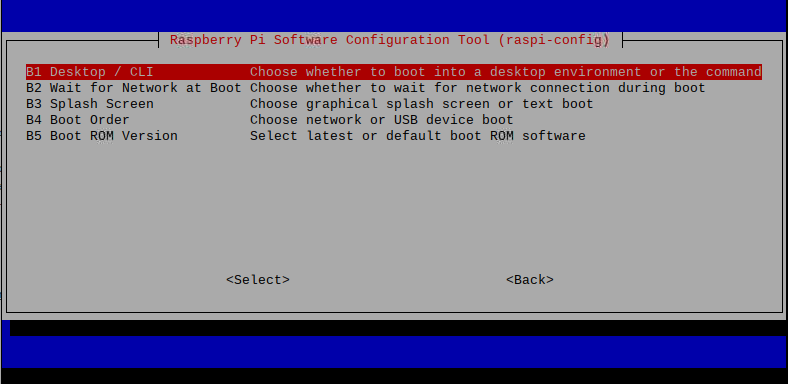

# rpi-build-qt-pyqt

Build Qt5 and PyQt5 on a Raspberry Pi

Tested with Qt5.15.1 and PyQt5-5.15.2 on a Raspberry Pi 4 Model B 4GB

# Build

1. Uncomment source line in sources-list

    * sudo nano /etc/apt/sources.list
    
      
    
    * ctrl+x and y

2. Update your system

    * sudo apt update
    * sudo apt full-upgrade
    * sudo reboot now
    * sudo rpi-update
    * sudo reboot now
    
3. Install [dependencies](https://wiki.qt.io/Building_Qt_5_from_Git)

	  * sudo apt-get build-dep qt5-default
	  * sudo apt-get install build-essential perl python git
	  * sudo apt-get install '^libxcb.*-dev' libx11-xcb-dev libglu1-mesa-dev libxrender-dev libxi-dev libxkbcommon-dev libxkbcommon-x11-dev
	  * sudo apt-get install flex bison gperf libicu-dev libxslt-dev ruby
	  * sudo apt-get install libxcursor-dev libxcomposite-dev libxdamage-dev libxrandr-dev libxtst-dev libxss-dev libdbus-1-dev libevent-dev libfontconfig1-dev libcap-dev libpulse-dev libudev-dev libpci-dev libnss3-dev libasound2-dev libegl1-mesa-dev gperf bison nodejs
	  * sudo apt-get install libasound2-dev libgstreamer1.0-dev libgstreamer-plugins-base1.0-dev libgstreamer-plugins-bad1.0-dev
	  * sudo apt install libclang-6.0-dev llvm-6.0
  
4. Download the Qt build script and check for the right version

    * wget https://raw.githubusercontent.com/tiagordc/raspberry-pi-qt-builds/master/build-qt.sh
    * sudo chmod +x build-qt.sh

5. Make sure the Pi boot into CLI and not desktop

    * sudo raspi-config
    
    	
    	
    	

6. Reboot and build Qt. This will take several hours.

    * sh build-qt.sh

7. Qt is now build on /home/pi/qtbuild. Install it to proceed with PyQt

    * cd /
    * sudo tar xf /home/pi/qtbuild/**Qt5.15.1-rpi-bin-minimal.tgz**

8. Add Qt to PATH

    * nano ~/.bashrc
        * export LD_LIBRARY_PATH=/usr/local/**Qt-5.15.1**/lib:$LD_LIBRARY_PATH
        * export PATH=/usr/local/**Qt-5.15.1**/bin:$PATH
      
    	
	
9. Build PyQt5

    * sudo apt-get install sip-dev
    * cd /usr/src
    * sudo wget https://www.riverbankcomputing.com/static/Downloads/sip/4.19.24/sip-4.19.24.tar.gz
    * sudo wget https://www.riverbankcomputing.com/static/Downloads/PyQt5/PyQt5-5.15.2.dev2010041344.tar.gz
    * sudo tar xzf sip-4.19.24.tar.gz
    * sudo tar xzf PyQt5-5.15.2.dev2010041344.tar.gz
    * cd sip-4.19.24
    * sudo python3 configure.py --sip-module PyQt5.sip
    * sudo make 
    * sudo make install
    * cd ../PyQt5-5.15.2.dev2010041344
    * sudo python3 configure.py --qmake /usr/local/Qt-5.15.1/bin/qmake --confirm-license
    * sudo make
    * sudo make install
    * cd /usr/src
    * sudo rm -rf sip-4.19.24 PyQt5-5.15.2.dev2010041344 sip-4.19.24.tar.gz PyQt5-5.15.2.dev2010041344.tar.gz

10. Pack PyQt

    * cd ~/qtbuild
    * tar czf PyQt5-rpi.tgz /usr/lib/python3/dist-packages/PyQt5

11. Check installation
    
# Install

# References

1. https://wiki.qt.io/Native_Build_of_Qt5_on_a_Raspberry_Pi
2. https://wiki.qt.io/Native_Build_of_Qt_5.4.1_on_a_Raspberry_Pi
3. https://wiki.qt.io/Building_Qt_5_from_Git
4. https://doc.bccnsoft.com/docs/PyQt5/installation.html
